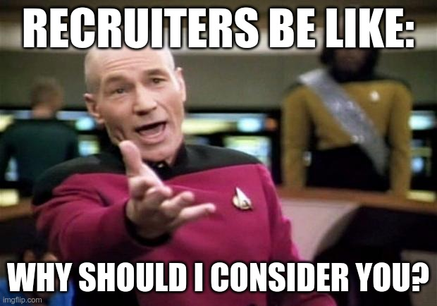

# **Stand out from the crowd**

Tips to improve your CV

<!--
- Present myself
- Disclaimer
  - Not an exact science because of the human factor (imperfections in the system we built).
  - Not an expert. Based on personal experience. 
- Straight to the point. Not a time to bore you. Try my best to facilitate discussion (ask question).
- Show of hand: Students, Devs, others.
-->

---

## Tech Dilemma

<!--
What is that tech dilemma?
-->

---
layout: iframe
url: https://layoffs.fyi
---

<!--
- Since some time now companies are doing layoffs and the pool of unemployed devs has become quite large.
- Many of them with the stamps of their previous employement on their CV.
- Thus the importance of standing out of that crowd.
-->

---

## Curriculum Vitae

Indirect presentation

1-3 pages

Scanned by recruiters on average in ~6-7s

<!-- <a v-click href="cv.pdf" target="_blank">Example</a> -->

<!--
This part is just to bring everybody up to speed aka find some common ground.
-->

---

### Tips

In no logical order.

<!--
While those tips work great for local companies, they are geared towards the global market (that's where most of my testing has been done).
-->

---

#### Tip #0

Optimise for humans first.

<!--
Always remember it will be read by humans. Specially speedreaders.
- Proper font styles and text heirarchy.
- Great constrast ratio. (No fancy background and colors)
- Sensible spacing and indentation.
- Be consistent.

Overall, keep the design simple!
-->

---

#### Tip #1

Prioritise the sections.

<!--
Most modern languages read from left to right and top to bottom. Priority should follow that order. (incl. sub-sections)

Example of an order: Personal Information, Experiences, Projects, Contributions, Awards, Certifications, Educations and Interests.
-->

---

#### Tip #2

Stay away from ★ ★ ★ ★ ☆ !

<!--
Star rating skills/talents aka infographics might be tempting but in fact it is very confusing and opened to too many interpretations.

Ideally lose the skill section. Add the skills under the relevant jobs and/or projects.
-->

---

#### Tip #3

Keep the summary short, sweet, factual and simple.

<!--
No need to repeat ourselves in the "Personal Information" section. No need to go into much details: that's the purpose of the other sections.

Use it to set the tone.
-->

---

#### Tip #4

Have an **active** LinkedIn profile.

<!--
Not every information will fit into our CV.

Also networking on LinkedIn can reap some unexpected benefits.
-->

---

#### Tip #5

Show impact! 💪

<!--
Every contribution we make should have a positive impact on the company. Afterall that's what we are employed for.
The customers do not care about the programming languages, libraries, frameworks or architectures we use.

The description under each job in the "Experiences" section is a great place to highlight those with **numbers** and **percentages**.

Use bullet points and action words (built, developed, created)!
-->

---

#### Tip #6

No need for personal photo.

<!--
Some companies pride themselves in being inclusive (m/f/d) and might be turned off with applications that include a personal photo.

While this rule varies from company to company and country to country, it is safest to leave the personal photo out.
-->

---

#### Tip #7

Attention to details.

<!--
Proof-read, proof-read, proof-read, proof-read, proof-read!
-->

---

#### Tip #8

Do not be scared of career breaks! 🏕️

<!--
We are humans and career breaks are natural. Mention them along with how they helped.
-->

---

#### Tip #9

Do not lie!

<!--
"Fake it until you make it" will backfire for sure during the interview process. Seasoned interviewers see through that easily.

Be authentic!
-->

---

#### Tip #10

Tailor it.

<!--
Stay away from general purpose CV. Tailor it to match the industry or sub-field you are in.
-->

---

#### Tip #11

Self-market yourself!

<!--
Sometimes we are too humble and do not put ourselves in the best light.

Understanding our strengths and weaknesses will help in putting our best self foward without coming out as arrogant but confident.

What are you bringing to the table? Why you and not the other X applicants?
-->

---

## Motivational letter

Why you are the perfect candidate for a certain position

1 page

Not to be confused with cover letter but apparently few people care

---

### Tips

In no logical order. (you know the drill)

---

### Tip #0

Do not skip it!

<!--
On most online application forms, it is optional but in reality, it is very much required.
If you want to stand out, it gives you the perfect opportunity.
It will allow you to fill in the gaps in your curriculum vitae since there is not enough space there to share all your amazing skills and qualifications.
-->

---

### Tip #1

Greet a person and not to whom it may concern.

<!--
Show that you've done your research and homework about the company.
Make it feel deliberately targeted.
-->

---

### Tip #2

Don't underestimate the opening.

<!--
Same as reading a story, spike the reader's interest with a strong opening.
Stay away from generic opening like “I’m writing to express my interest in the position of…”.. 
Be more creative!
-->

---

### Tip #3

DRY!

<!--
As you are filling in the gaps in your curriculum vitae, 
don't repeat yourself but expand qualifications and why you are a good match for the position.
-->

---

### Tip #4

Hehe, I know this and that!

<!--
Transitioning from the previous tip, as you are expanding on your qualifications, 
point out your key skills that reassure the interviewer that there is no better fit than you.
In essence, you are helping the interviewer connect the dots.
-->

---

### Tip #5

Tailor!

<!--
Don't wanna repeat myself but I want to get this through.
Show that you care about the position and didn't just throw a dynamite in the lake hoping to catch something.
-->

---

## Bonus: Interview

---

## Q&A
