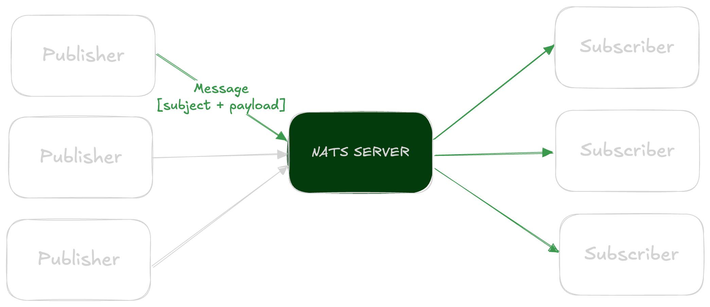
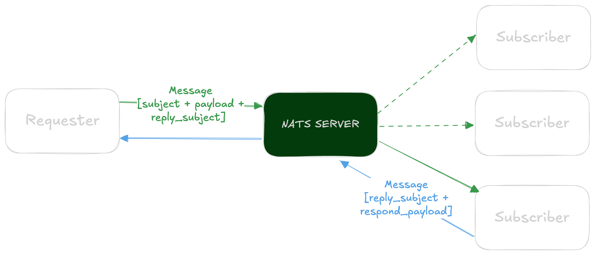
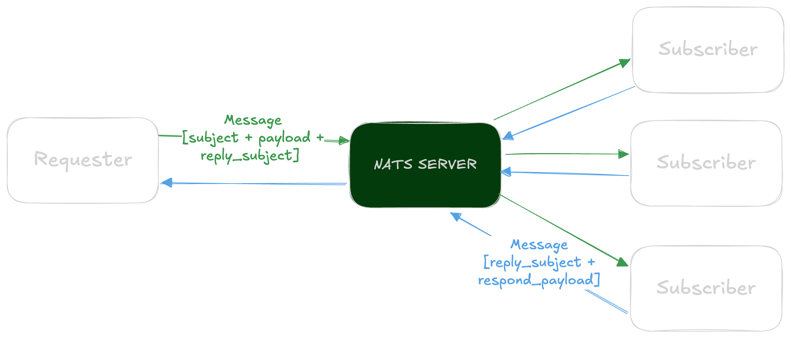

Who am I?
---

- Software engineer @ Livestorm
- Been in the game for about 16 years now
- I Love Go
- Neovim enthusiast
- I use Arch btw


<!-- end_slide -->

What is NATS?
---

**NATS** is a simple, secure, and performant messaging system

## Lightweight
- Small footprint (less than 20MiB)
- Minimal dependencies (no third-party Go dependencies)

## High Performance
- 100's of thousand of messages per second on mere 32MiB of memory
- Can be scaled horizontally easily

## Resilient
- Clustering is straightforward
- Clusters can form Super Clusters across AZs and Cloud providers

## Simple
- Easy to deploy, configure, and use

## Secure
- Built-in security with TLS and authentication

<!-- end_slide -->

Architecture Patterns - Monolith
---

## Single Deployable Unit
- All components in one application
- Shared database and runtime
- Direct method calls between components

### Pros
- Simple deployment
- Easy debugging
- Good performance

### Cons
- Hard to scale components independently
- Technology lock-in

<!-- end_slide -->

Architecture Patterns - Microservices
---

## Independent Services
- Separate deployable services
- Each service owns its data
- Network communication (HTTP/gRPC)

### Pros
- Independent scaling
- Technology diversity
- Team autonomy

### Cons
- Complex deployment
- Network latency
- Distributed system challenges

<!-- end_slide -->

Architecture Patterns - Serverless
---

## Function-as-a-Service (FaaS)
- Event-driven, stateless functions
- Cloud provider managed infrastructure
- Pay-per-execution model

### Pros
- No infrastructure management
- Automatic scaling
- Cost-effective*

### Cons
- Vendor lock-in
- Cold starts
- Limited execution time

<!-- end_slide -->

Architecture Patterns - Modular Monolith
---

## Best of Both Worlds
- Single deployment with well-defined modules
- Clear boundaries within shared runtime
- Message-based communication between modules

### Pros
- Simple deployment
- Loose coupling
- Easy testing

### Cons
- Still shared runtime
- Requires discipline

<!-- end_slide -->

NATS Core Concepts
---

<!-- column_layout: [1, 1, 1] -->

<!-- column: 0 -->

## Publishers & Subscribers
- Fire-and-forget messaging
- Many-to-many communication
- Single publisher-side order guarantee

<!-- column: 1 -->

## Subjects
- Messages published to subjects (topics)
- Hierarchical naming
  - `user.profile.updated`
- Wildcards
  - `*` matches single token
    - `user.*.updated`
  - `>` matches multiple tokens
    - `user.>`

<!-- column: 2 -->

## Delivery guarantees
- At most once delivery (Core NATS)
- At least once or exactly once delivery (JetStream)

<!-- reset_layout -->



<!-- end_slide -->

NATS Basic Patterns - Request-Reply
---

## Auto-generated Inbox

NATS creates unique inbox subjects for each request to route replies back to the correct client

## Synchronous

Blocking request calls like a gRPC requests

## Timeout Required

Clients must implement timeouts since there's no guarantee of receiving a response



<!-- end_slide -->

NATS Basics Patterns - Publish-Request
---

## Self-specified Inbox

Specify your own unique inbox subject and subscribe to it

## Sync/Async

Publishers do not wait for a response. Inbox subscribers can wait asynchronously or synchronously

## Multiple Responders

Allows for multiple subscribers to respond to the same message



<!-- end_slide -->

NATS Basics Patterns - Queue Groups
---

## Load Balancing

Subscribers form a queue group and messages are distributed evenly across them

## Scaling made easy

Scale up or down simply by adding or removing subscribers

## Short-circuit

Request made when there's no subscriber receives a "no-responders" protocol message


<!-- end_slide -->

Go NATS Basics - Connect & Publish
---

```go {all|4|9-14|16-17|19-20} +line_numbers +no_background
package main

import (
    "github.com/nats-io/nats.go"
    "log"
)

func main() {
    // Connect to NATS server
    nc, err := nats.Connect(nats.DefaultURL)
    if err != nil {
        log.Fatal(err)
    }
    defer nc.Close()

    // Publish a message
    nc.Publish("user.signup", []byte("user123"))

    // Ensure message is sent
    nc.Flush()
}
```

<!-- end_slide -->

Go NATS Basics - Request-Reply
---

```go {all|1-3|5-7} +line_numbers +no_background
// Request-Reply pattern
reply, _ := nc.Request("user.get", []byte("user123"), time.Second)
log.Printf("User data: %s", string(reply.Data))

// Publish-Request pattern
replyTo := nc.NewRespInbox()
_ = nc.PublishRequest("user.get", replyTo, []byte("user123"))
```

<!-- end_slide -->

Go NATS Basics - Subscribe
---

```go {all|1-5|7-11|13-17} +line_numbers +no_background
// Simple subscription
sub, _ := nc.Subscribe("user.*", func(m *nats.Msg) {
    log.Printf("Received: %s on %s", string(m.Data), m.Subject)
})
_ = sub.Unsubscribe()

// Queue group subscription (load balancing)
sub, _ = nc.QueueSubscribe("orders.process", "workers", func(m *nats.Msg) {
    log.Printf("Processing order: %s", string(m.Data))
})
_ = sub.AutoUnsubscribe(3)

// Synchronous subscription
sub, _ := nc.SubscribeSync("updates")
// Wait for a message
msg, _ := sub.NextMsg(10 * time.Second)
log.Printf("Got an update: %s", string(msg.Data))
```

<!-- end_slide -->

Why Embedded NATS for Modular Monoliths?
---

**Traditional Approach**
- Direct method calls between modules
- Tight coupling, difficult to test
- Hard to extract to microservices later

**NATS Approach**
- Message-based communication
- Loose Coupling
  - Modules communicate via messages, not direct calls
  - Easy to mock for testing
- Observability
  - All inter-module communication is visible
  - Easy to add logging, metrics, tracing
- Migration Path
  - Move modules to separate services gradually
  - Same NATS communication patterns work distributed
- Resilience
  - Async communication patterns
  - Built-in timeout handling

<!-- end_slide -->

Embedded NATS Architecture
---

```go +no_background
         Application (Process)

┌───────────┬─────────────┬───────────┐
│   User    │    Order    │  Payment  │
│  Module   │   Module    │  Module   │
├───────────┼─────────────┼───────────┤
│             NATS Server             │
│             (Embedded)              │
└─────────────────────────────────────┘
```

All modules communicate through NATS subjects, maintaining clear boundaries while running in the same process.

<!-- end_slide -->

Setting Up Embedded NATS
---

```go {all|11|23} +line_numbers +no_background
package main

import (
    "github.com/nats-io/nats-server/v2/server"
    "github.com/nats-io/nats.go"
)

func main() {
    // Start embedded NATS server
    ns, err = server.NewServer(&server.Options{
        DontListen: true,
    })
    if err != nil {
        log.Fatal(err)
    }
 
    go ns.Start()
    defer ns.Shutdown()

    // In-process connection (no TCP)
    nc, _ := nats.Connect(
        ns.ClientURL(),
        nats.InProcessServer(ns),
    )
    defer nc.Close()
}
```

<!-- end_slide -->

Modular Monolith Example - User Module
---

```go {all|27} +line_numbers +no_background
type UserModule struct {
    nc *nats.Conn
}

func (u *UserModule) Start() error {
    // Handle user creation requests
    u.nc.Subscribe("user.create", u.handleCreateUser)
    
    // Handle user queries
    u.nc.Subscribe("user.get", u.handleGetUser)
    
    return nil
}

func (u *UserModule) handleCreateUser(m *nats.Msg) {
    var req CreateUserRequest
    json.Unmarshal(m.Data, &req)
    
    // Create user logic here
    user := createUser(req)
    
    // Publish user created event
    userData, _ := json.Marshal(user)
    u.nc.Publish("events.user.created", userData)
    
    // Reply with created user
    m.Respond(userData)
}
```

<!-- end_slide -->

Modular Monolith Example - Order Module
---

```go +line_numbers +no_background
type OrderModule struct {
    nc *nats.Conn
}

func (o *OrderModule) Start() error {
    // Listen for user creation events
    o.nc.Subscribe("events.user.created", o.handleUserCreated)
    
    // Handle order creation
    o.nc.Subscribe("order.create", o.handleCreateOrder)
    
    return nil
}

func (o *OrderModule) handleCreateOrder(m *nats.Msg) {
    var req CreateOrderRequest
    json.Unmarshal(m.Data, &req)
    
    // Get user info via NATS request
    reqData, _ := json.Marshal(GetUserRequest{
        ID: req.UserID,
    })
    reply, err := o.nc.Request("user.get", reqData, time.Second)
    
    // Process order with user data
    order := createOrder(req, parseUser(reply.Data))
    orderData, _ := json.Marshal(order)
    m.Respond(orderData)
}
```

<!-- end_slide -->

Testing with NATS
---

```go +line_numbers +no_background
func TestUserModule(t *testing.T) {
    // Start test NATS server
    s := natstest.RunDefaultServer()
    defer s.Shutdown()
    
    nc, _ := nats.Connect(s.ClientURL())
    defer nc.Close()
    
    userModule := &UserModule{nc: nc}
    userModule.Start()
    
    // Test user creation
    reqData, _ := json.Marshal(CreateUserRequest{
        Name: "John Doe",
    })
    reply, err := nc.Request("user.create", reqData, time.Second)
    
    // Assert user was created correctly
    assert.NoError(t, err)
}
```

<!-- end_slide -->

Migration Strategy
---

**Phase 1: Modular Monolith with Embedded NATS**
- All modules in single process
- Communication via NATS subjects

**Phase 2: Extract Critical Modules**
- Move high-load modules to separate services
- Keep NATS communication patterns

**Phase 3: Full Microservices (if needed)**
- All modules as independent services
- External NATS cluster for communication

The beauty: **Same code patterns throughout all phases!**

<!-- end_slide -->

<!-- jump_to_middle -->

Questions?
---

<!-- end_slide -->

<!-- jump_to_middle -->


