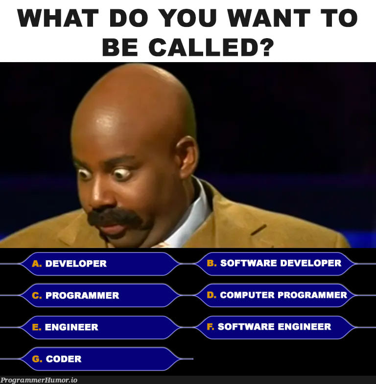

Who am I?
---

- Software engineer @ Livestorm
- Been in the game for about 16 years now
- I Love Go
- I'm here to share experience, not replace a Google search
- I use Arch btw

<!-- end_slide -->

Why Are We Here?
---

<!-- pause -->

- This is not a language comparison or popularity contest
- You're here to learn how to think about language choices
- Not which languages to memorize or focus on
- Framework for decision-making based on real experience

<!-- end_slide -->

The Reality Check
---

<!-- pause -->

- Most developers work with 2-3 languages throughout their career
- Companies often constrain choices based on existing codebase
- Your first language may not be your last
- Your ability to choose wisely matters more than any single language

<!-- pause -->

> [!tip]
> I'm not here to replace a Google search or language documentation. I'm sharing my experience to help you think critically about choices.

<!-- end_slide -->

Roadmap
---

<!-- pause -->

- Technical factors: Performance, type systems, ecosystem
- Team factors: Expertise, hiring, culture
- Business factors: Cost, time-to-market, long-term viability
- Management perspective: How to pitch language decisions
- Practical advice for students entering the industry

<!-- end_slide -->

Technical Factors: Performance & Scalability
---

<!-- pause -->

- When performance matters: real-time systems, high-throughput applications, embedded systems
- Trade-offs between development speed and execution speed
- Consider scale: Will your application handle millions of requests?

<!-- pause -->

| Context | Priority Consideration |
|---------|----------------------|
| Web applications | Development speed often trumps raw performance |
| High-frequency trading | Milliseconds matter - choose accordingly |
| Mobile apps | Battery efficiency and bundle size |
| System utilities | Low-level control and memory management |

<!-- end_slide -->

Technical Factors: Type Systems & Safety
---

<!-- pause -->

- Static vs. Dynamic types: Each has its place
- Memory safety: Critical for certain domains
- Type safety can prevent entire classes of bugs

<!-- pause -->

<!-- column_layout: [2, 1] -->

<!-- column: 0 -->

**Static typing benefits:**
- Catch errors at compile time
- Better IDE support and refactoring
- Self-documenting code
- Easier for large codebases

**Dynamic typing benefits:**
- Faster prototyping
- More flexible and expressive
- Less boilerplate code
- Easier for beginners

<!-- column: 1 -->

**When to choose:**

Critical systems: Static
→ Banking, medical, safety

Rapid prototyping: Dynamic
→ Startups, MVPs, scripts

<!-- reset_layout -->

<!-- end_slide -->

Technical Factors: Ecosystem & Libraries
---

<!-- pause -->

- Availability of mature libraries for your domain
- Community support and documentation quality
- Long-term viability of the ecosystem
- Third-party integrations you'll need

<!-- pause -->

> [!caution]
> A language might be perfect technically, but if there's no ecosystem for your problem domain, you're building everything from scratch.

<!-- end_slide -->

Technical Factors: Learning Curve & Productivity
---

<!-- pause -->

- Time to proficiency for your team
- Developer productivity impact over time
- How steep is the learning curve for new developers?
- Does the language have good tooling and documentation?

<!-- pause -->

**Productivity paradox:**

Sometimes choosing a "worse" language yields faster results because your team already knows it well. Expert developers in any language can outperform novices in the "best" language.

<!-- end_slide -->

Team Factors: Existing Expertise
---

<!-- pause -->

- What does your team already know?
- Cost of upskilling vs. hiring new talent
- Onboarding time for new team members
- Knowledge transfer overhead

<!-- pause -->

**The team velocity equation:**

New language = Learning time + Training + Reduced velocity initially + Long-term gains vs. Familiar language = Immediate velocity + Maintenance costs + Technical debt risk

<!-- end_slide -->

Team Factors: Hiring & Talent Pool
---

<!-- pause -->

- Market demand and availability of developers
- Regional variations in talent pools
- Competition for talent in popular languages
- Student perspective: Languages that make you marketable

<!-- pause -->

| Tier | Description |
|------|-------------|
| High demand | Large talent pool, easier hiring |
| Medium demand | Specialized talent, higher costs |
| Niche | Harder to hire, often higher salaries |

<!-- end_slide -->

Team Factors: Culture & Morale
---

<!-- pause -->

- Developer satisfaction impacts retention and productivity
- Language choice affects team dynamics and collaboration
- Frustrating tools lead to burnout
- Happy developers write better code

<!-- pause -->

> [!tip]
> Sometimes the "best" technical choice is the wrong choice if it makes your team miserable. Culture matters more than code.

<!-- end_slide -->

Business Factors: Time-to-Market
---

<!-- pause -->

- MVP considerations: Move fast and break things
- Prototype vs. production code: Different needs
- When to choose "good enough" over "perfect"
- Opportunity costs of over-engineering

<!-- pause -->

**Startup wisdom:**

The best language is the one that ships your product to market before you run out of money. You can always rewrite later if successful.

<!-- end_slide -->

Business Factors: Total Cost of Ownership
---

<!-- pause -->

- Development costs: Salaries, training, tools
- Maintenance and bug fixing over time
- Technical debt accumulation
- Infrastructure and operational costs

<!-- pause -->

**Hidden costs:**

- Debugging time (safety vs. flexibility)
- Onboarding new developers
- Lost productivity from tool friction
- Cost of mistakes (security breaches, crashes)

<!-- end_slide -->

Business Factors: Long-term Viability
---

<!-- pause -->

- Language stability and backwards compatibility
- Corporate backing vs. community-driven
- Historical examples of language migrations
- Risk of the language dying or being abandoned

<!-- pause -->

**Viability signals:**

- Active development and regular releases
- Large, growing community
- Major companies using it in production
- Clear roadmap and governance

<!-- end_slide -->

Business Factors: Vendor Lock-in Risk
---

<!-- pause -->

- Platform-specific languages and their implications
- Cloud provider tie-ins
- Open source alternatives
- Migration costs and strategies

<!-- pause -->

> [!caution]
> Choosing a vendor-locked language trades flexibility for productivity. Ensure you understand the long-term implications.

<!-- end_slide -->

Management Perspective: The Business Case
---

<!-- pause -->

- Speak their language: ROI, efficiency, risk reduction
- Quantify benefits where possible
- Address concerns proactively
- Focus on business outcomes, not technical preferences

<!-- pause -->

**Framework:**

Problem → Impact → Solution → Benefits → Metrics → Risk mitigation

<!-- end_slide -->

Management Perspective: Common Objections
---

<!-- pause -->

| Objection | Counterargument |
|-----------|----------------|
| "Why change?" | Modernization benefits, competitive advantage |
| "Too risky" | Phased migration, pilot projects, rollback plans |
| "Hiring will be hard" | Growing talent pool, training investments, remote work |
| "Too expensive" | Long-term savings, reduced technical debt |
| "Not proven" | Show case studies and industry adoption |

<!-- end_slide -->

Management Perspective: Building the Presentation
---

<!-- pause -->

- Start with business problems, not technical solutions
- Include pilot project proposals
- Show competitive advantages
- Provide realistic timelines and resource estimates

<!-- pause -->

**Tips:**

- Use analogies that resonate with business leaders
- Show, don't just tell
- Be prepared to discuss alternatives
- Acknowledge risks and have mitigation plans

<!-- end_slide -->

Decision-Making Framework
---

<!-- pause -->

1. Identify your constraints and priorities
2. List factors that matter for your context
3. Weight factors based on importance
4. Evaluate language options objectively
5. Make a decision and document the rationale

<!-- pause -->

**Key insight:**

The "right" choice depends entirely on your specific situation. A choice that's perfect for one project may be disastrous for another.

<!-- end_slide -->

The Decision Matrix
---

<!-- pause -->

Create a weighted score for each option:

| Factor | Weight | Option A | Option B | Option C |
|--------|--------|----------|----------|----------|
| Performance | 30% | 8 | 5 | 7 |
| Team expertise | 25% | 6 | 9 | 5 |
| Ecosystem | 20% | 7 | 6 | 8 |
| Hiring pool | 15% | 7 | 8 | 5 |
| Learning curve | 10% | 5 | 7 | 4 |
| **Total Score** | | **6.85** | **7.1** | **6.25** |

<!-- end_slide -->

When to Break the Rules
---

<!-- pause -->

- Passion projects and personal learning
- Innovation and experimentation
- Startup phases where speed trumps everything
- Research and prototyping
- When you have a unique constraint

<!-- pause -->

> [!tip]
> Guidelines exist to help you think, not to constrain you. Understand the rules before you break them.

<!-- end_slide -->

Practical Advice for Students: What to Focus On Now
---

<!-- pause -->

- Learn fundamentals, not just syntax
- Understand concepts that transfer between languages
- Choose a language with strong community support
- Build real projects, don't just watch tutorials
- Learn how to learn new languages efficiently

<!-- pause -->

**Core fundamentals:**

- Data structures and algorithms
- Design patterns and architectural concepts
- Testing and debugging
- Version control and collaboration
- Problem-solving mindset

<!-- end_slide -->

Practical Advice: Building Your Portfolio
---

<!-- pause -->

- Show breadth with multiple languages
- Demonstrate depth in at least one
- Highlight problem-solving, not just coding
- Include projects with different constraints
- Document your decision-making process

<!-- pause -->

**Portfolio diversity:**

- One large project (depth)
- Several smaller projects (breadth)
- Different domains (web, CLI, data, etc.)
- Different language families (compiled, interpreted, functional, etc.)

<!-- end_slide -->

Practical Advice: Interview Tips
---

<!-- pause -->

- Discussing language choices shows critical thinking
- Demonstrate you consider trade-offs
- Show you're open to learning anything
- Ask about their technology decisions
- Be honest about what you don't know

<!-- pause -->

**Questions to ask:**

- How do you decide which technologies to use?
- What's your process for evaluating new languages or frameworks?
- What trade-offs have you made in your current stack?

<!-- end_slide -->

Key Takeaways
---

<!-- pause -->

- No "perfect" language exists - context is everything
- Consider technical, team, and business factors together
- Your ability to choose wisely matters more than any single language
- Focus on fundamentals that transfer between languages
- Learn how to think about problems, not memorize syntax

<!-- pause -->

> [!tip]
> The best language is the one that solves your specific problem within your specific constraints.

<!-- end_slide -->

Final Thoughts
---

<!-- pause -->

- I'm sharing experience, not replacing Google or documentation
- Tools and languages change - thinking critically doesn't
- Your first language won't be your last
- Your ability to adapt and choose well will serve you throughout your career
- The most valuable skill is knowing how to choose the right tool for the job

<!-- end_slide -->

Questions?
---

<!-- end_slide -->

Thank you!
---

<!-- new_lines: 12 -->

<!-- end_slide -->
